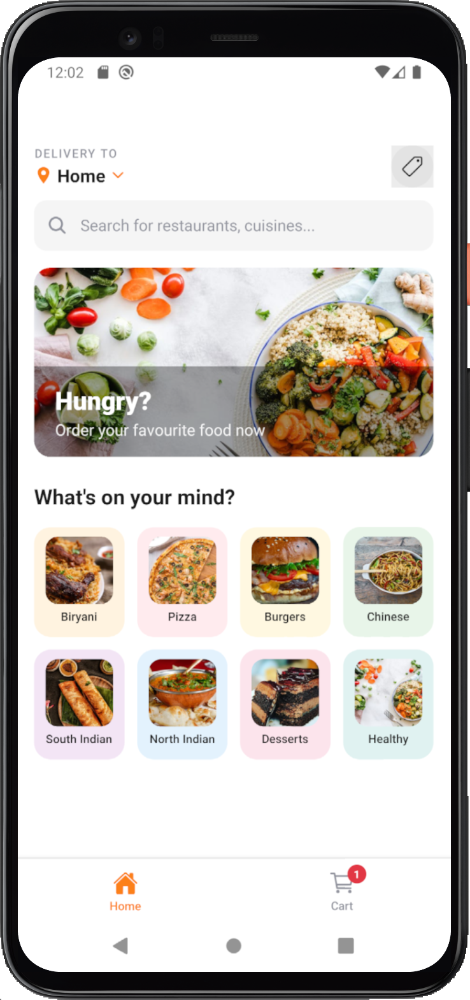
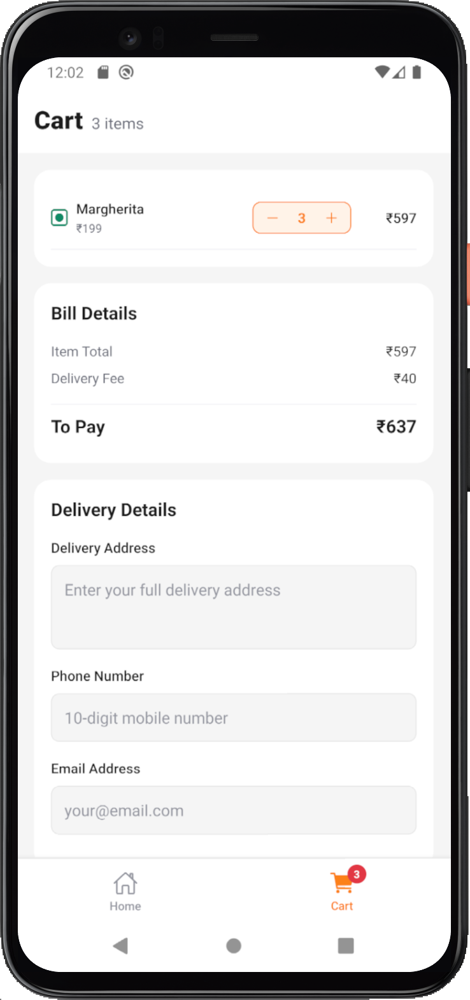
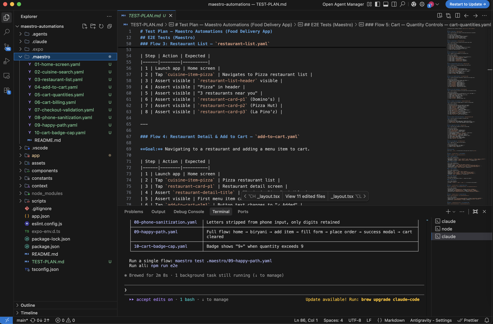

# Mobile E2E Testing with Maestro + Claude

A food delivery app built with **Expo (React Native)** — used as a real-world target for demonstrating how to write mobile E2E tests using **Maestro**, with tests authored by **Claude Code**.

---

## What This Project Demonstrates

- Building a production-style React Native app with Expo Router
- Writing a complete E2E test suite using Maestro (YAML flows)
- Using Claude Code to analyse the codebase and generate tests automatically
- Testing real user flows: browse → add to cart → checkout

---

## The App

A food delivery app with three core flows:

**Browse** → Pick a cuisine from a grid of 8 categories, browse restaurants, view menus

**Cart** → Add items, adjust quantities, see live bill breakdown (subtotal + ₹40 delivery fee)

**Checkout** → Fill delivery address, phone, email, place order, see success confirmation

### Previews

<p align="center">
  
  
  
</p>
<p align="center">
  
</p>
<p align="left">
    
</p>

---

## Architecture

```
maestro-automations/
├── app/
│   ├── (tabs)/
│   │   ├── index.tsx          # Home screen — cuisine grid + search
│   │   └── cart.tsx           # Cart screen — items, billing, checkout form
│   └── restaurants/
│       ├── [cuisine].tsx      # Restaurant list (dynamic route)
│       └── [cuisine]/
│           └── [id].tsx       # Restaurant detail + menu
├── components/
│   └── CustomTextInput.tsx    # Reusable form input with label + inline error
├── constants/
│   ├── data.ts                # All static data — cuisines, restaurants, menu items
│   └── theme.ts               # Design tokens — colors, spacing, typography
├── context/
│   └── CartContext.tsx        # Global cart state via React Context
└── .maestro/
    └── *.yaml                 # E2E test flows
```

---

## E2E Tests (Maestro)

Maestro tests are plain YAML files. Each flow describes a user journey using `tapOn`, `inputText`, and `assertVisible` commands targeting `testID` values.

### Flows

| File                          | What it covers                                                                              |
| ----------------------------- | ------------------------------------------------------------------------------------------- |
| `01-home-screen.yaml`         | App launches, cuisine grid and hero banner visible                                          |
| `02-cuisine-search.yaml`      | Search filters cuisines live, clear restores grid, no-match shows empty state               |
| `03-restaurant-list.yaml`     | Tapping a cuisine navigates to its restaurant list with correct count                       |
| `04-add-to-cart.yaml`         | Tap ADD on a menu item, button shows "✓ Added", cart badge increments                       |
| `05-cart-quantities.yaml`     | Increase/decrease quantity, decrement to 0 removes item                                     |
| `06-cart-billing.yaml`        | Subtotal + ₹40 delivery = correct total, updates when quantity changes                      |
| `07-checkout-validation.yaml` | All three field errors shown on empty submit, specific messages per rule                    |
| `08-phone-sanitization.yaml`  | Non-digit characters stripped from phone input automatically                                |
| `09-happy-path.yaml`          | Full flow: home → cuisine → restaurant → add item → checkout → success modal → cart cleared |
| `10-cart-badge-cap.yaml`      | Badge shows "9+" when item count exceeds 9                                                  |

### Running Tests

```bash
# Run all flows
npm run e2e

# Run a single flow
maestro test .maestro/09-happy-path.yaml

# Interactive debugger
maestro studio
```

### Maestro Studio Demo

<video src="https://github.com/ujwalsinghania/ai-exploration/blob/main/maestro-automations/screenshots/maestro-studio-demo.mp4" width="180"></video>

---

## Writing Tests with Claude Code

All 10 E2E flows in this project were generated by **Claude Code** — no manual YAML authoring required.

### How It Works

Claude Code reads the actual source files — screens, components, data, utils — and uses that context to write tests grounded in real implementation details: correct `testID` values, exact item prices, actual validation error messages.

Claude first explored the full codebase — screens, routes, context, utils, and constants — then produced a structured `TEST-PLAN.md` covering every scenario. The second prompt triggered generation of all 10 Maestro flow files in one pass, with assertions derived directly from the source: real `testID` values, exact prices from `data.ts`, and verbatim error messages from `utils.ts`.

### Test Plan First

Before writing flows, Claude produced `TEST-PLAN.md` — a structured breakdown of every E2E scenario and unit test case. The YAML flows implement that plan directly.

---

## Unit Tests (Jest)

Utility functions are tested separately with Jest — no device or emulator needed.

```bash
npm test
```

Covered in `__tests__/`:

- `validate()` — all address, phone, and email rules
- `getVegDotStyle()` / `getVegDotInnerStyle()` — veg/non-veg indicator styles
- `getCuisineItemStyle()` — cuisine card background color
- `getListContainerStyle()` / `getScrollContentStyle()` — safe area padding calculations

---

## Setup

```bash
npm install

# iOS
npm run ios

# Android
npm run android
```

Install Maestro:

```bash
curl -fsSL "https://get.maestro.mobile.dev" | bash
```
