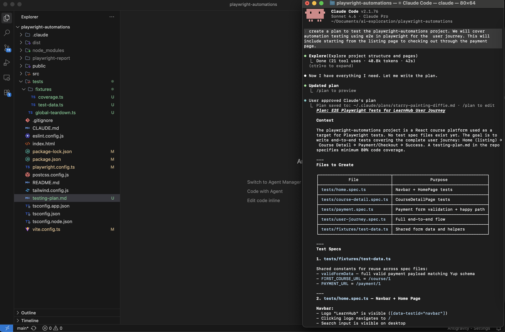
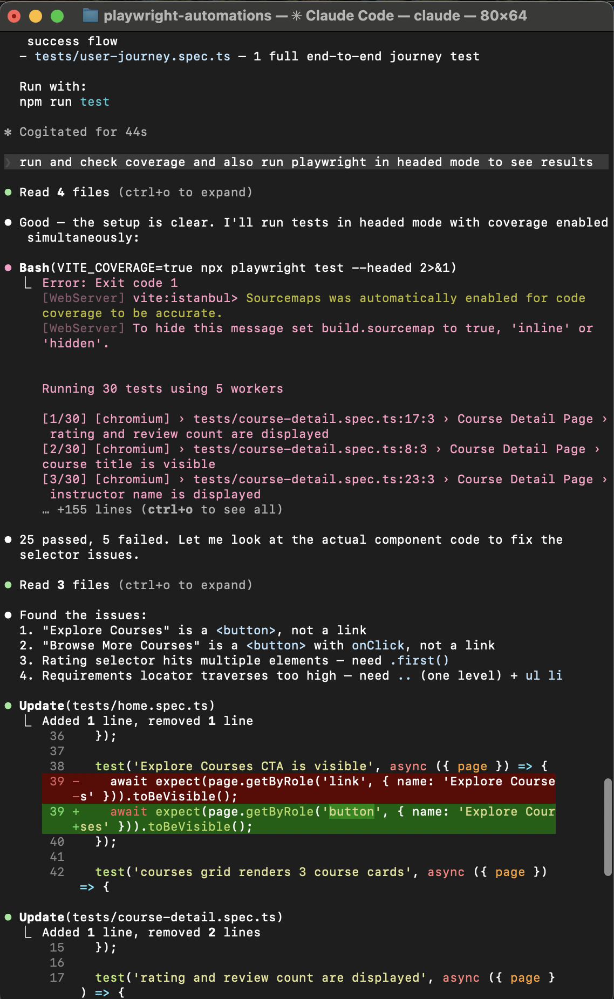
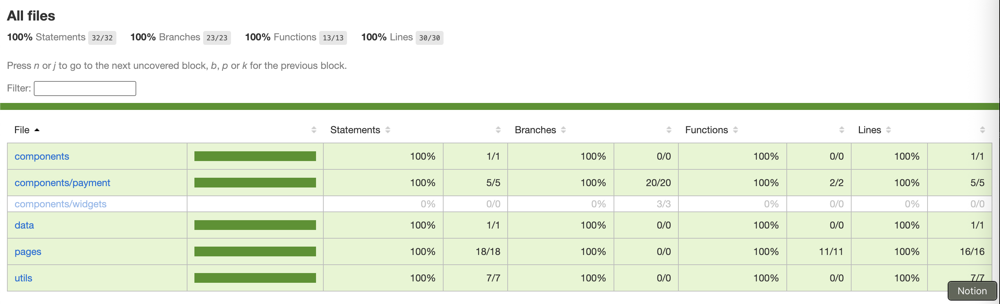
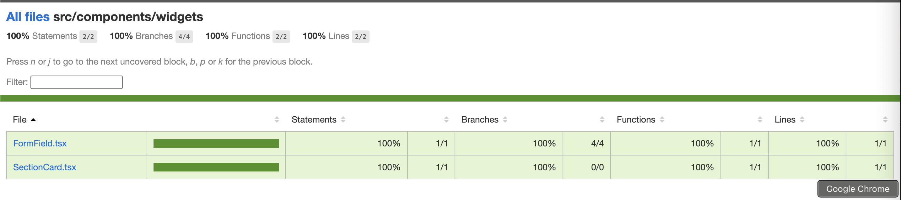

# LearnHub — Playwright Automation Demo

A React 19 + TypeScript + Vite course platform built as a target for end-to-end and unit test automation.

---

## AI-Assisted Test Development

This project's test suite was written with the help of **Claude Code** (Anthropic's AI coding assistant).

### How it worked

1. **Planning** — Claude Code explored the codebase, identified all pages, routes, components, form fields, `data-testid` selectors, and validation rules, then produced a structured test plan covering the full user journey. The plan is written in `tests/e2e/fixtures/test-plan.md`.
2. **Execution** — The approved plan was executed by Claude Code, writing all E2E and unit test files, fixing selector issues discovered during the first run, wiring up coverage collection, and organizing tests into separate `e2e/` and `unit/` folders.

### Claude in action

**Video — Claude executing the plan and writing tests:**

<video src="screenshots/execution.mov" width="600" controls></video>

> Claude writing all spec files, running them headed, and iterating on failures in one session.

---

**Claude generating the test plan:**



> Claude explored the codebase — pages, routes, `data-testid` selectors, Yup validation rules — and produced a structured plan before writing a single line of test code.

---

**Claude correcting failures after the first run:**



> After the initial run returned 5 failures, Claude read the component source, identified the root causes (e.g. `Explore Courses` and `Browse More Courses` are `<button>` elements not links; the rating selector matched multiple elements), and patched each selector.

---

**E2E coverage report — 100% across all pages and components:**



---

**Unit coverage report — widgets folder (FormField + SectionCard):**



---

## App Overview

Three-page course platform with a full checkout flow:

| Route          | Page                  |
| -------------- | --------------------- |
| `/`            | Home — course listing |
| `/course/:id`  | Course detail         |
| `/payment/:id` | Checkout + payment    |

**Stack:** React 19, TypeScript, Vite, React Router, React Hook Form, Yup, Tailwind CSS

---

## Test Suite

### E2E Tests (Playwright)

Located in `tests/e2e/`. Run against a live Chromium browser with the Vite dev server auto-started.

| File                    | Coverage                                            |
| ----------------------- | --------------------------------------------------- |
| `home.spec.ts`          | Navbar, hero, course grid, category filters         |
| `course-detail.spec.ts` | Course page, sidebar, Buy Now navigation            |
| `payment.spec.ts`       | Form validation, happy path, success screen         |
| `user-journey.spec.ts`  | Full flow: Home → Course → Payment → Success → Home |

### Unit Tests (Vitest)

Located in `tests/unit/`. DOM rendered with jsdom + Testing Library, no browser required.

| File                 | Coverage                                   |
| -------------------- | ------------------------------------------ |
| `FormField.test.tsx` | Label, required asterisk, error display    |
| `payment.test.tsx`   | CheckoutForm, OrderSummary, PaymentSuccess |

---

## Commands

```bash
npm run dev                  # Start dev server at http://localhost:5173
npm run build                # Type-check and build for production
npm run lint                 # Run ESLint

# E2E tests (Playwright)
npm run test                 # Run all E2E tests (headless)
npm run test:ui              # Open Playwright interactive UI
npm run test:report          # View last HTML test report
npm run test:coverage        # Run E2E tests with Istanbul coverage (nyc)
npm run coverage:report      # Print nyc coverage report

# Unit tests (Vitest)
npm run test:unit            # Run unit tests
npm run test:unit:coverage   # Run unit tests with v8 coverage report
```

Run a single E2E file:

```bash
npx playwright test tests/e2e/payment.spec.ts
```

Run tests matching a title:

```bash
npx playwright test -g "full user journey"
```

---

## Project Structure

```
src/
  data/courses.ts           # Static course data (source of truth)
  pages/                    # HomePage, CourseDetailPage, PaymentPage
  components/
    Navbar.tsx
    CourseCard.tsx
    payment/                # CheckoutForm, OrderSummary, PaymentSuccess
    widgets/                # FormField, SectionCard
  utils/constants.ts        # Yup validation schema, categories, countries
  types/payment.ts          # FormData & FormErrors interfaces

tests/
  e2e/
    fixtures/               # Coverage collector, shared test data
    home.spec.ts
    course-detail.spec.ts
    payment.spec.ts
    user-journey.spec.ts
  unit/
    FormField.test.tsx
    payment.test.tsx
  global-teardown.ts        # Flushes nyc coverage after E2E run
```
